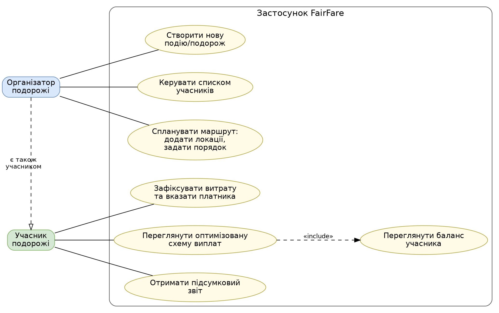
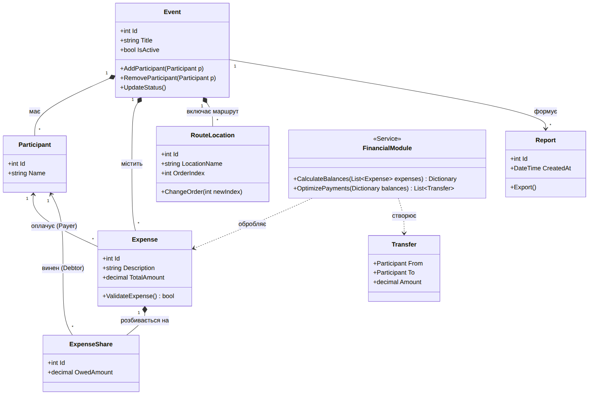
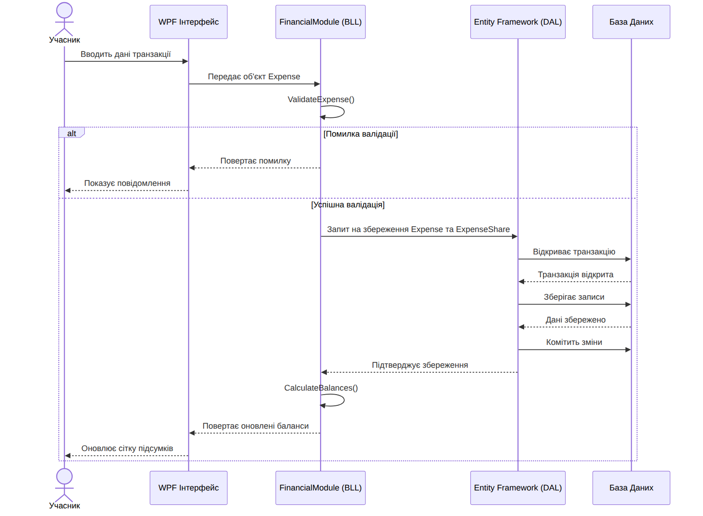
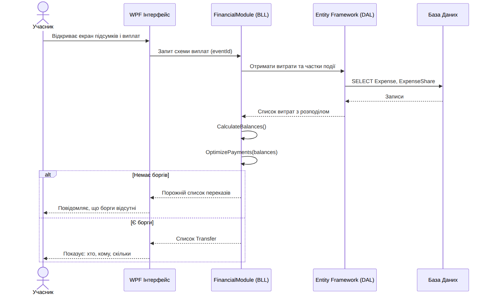
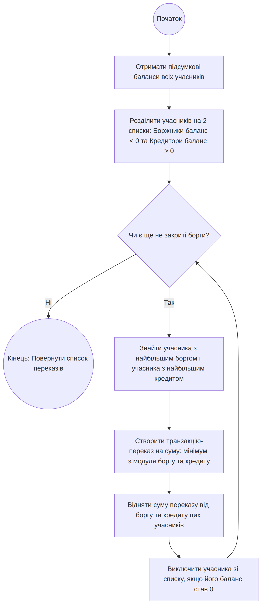
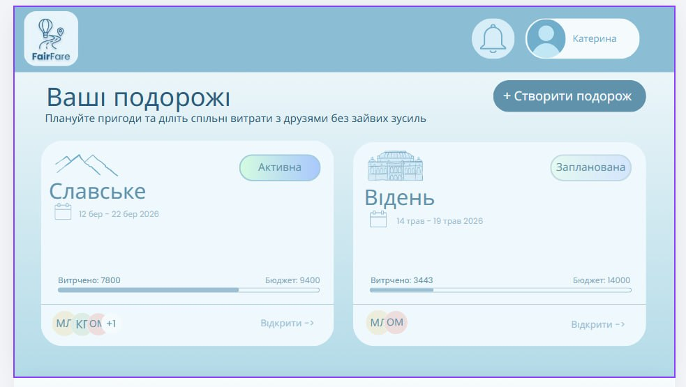
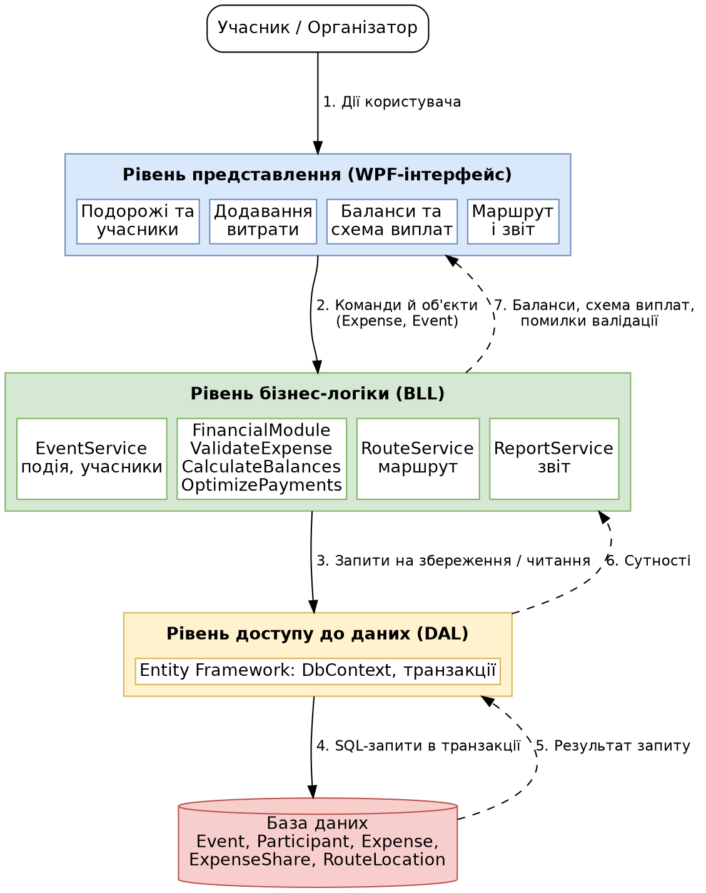

**FairFare**

Планування подорожей і справедливий розподіл спільних витрат

**Етап 3. Моделювання та проєктування**

# 1. Загальна інформація

FairFare – застосунок для планування групових подорожей та обліку
спільних витрат. Він дозволяє створити подорож, додати учасників,
спланувати маршрут, зафіксувати витрати, переглянути баланси, отримати
оптимізовану схему взаєморозрахунків і підсумковий звіт.

Цей документ містить комплект моделей, передбачений 3 етапом:

- UML-діаграми, необхідні для пояснення системи (розділ 2);

- опис основних сценаріїв (розділ 3);

- макети початкового проєкту інтерфейсу (розділ 4);

- схема основних потоків взаємодії між інтерфейсом, логікою та даними
  (розділ 5).

Архітектура застосунку тришарова: WPF-інтерфейс, шар бізнес-логіки (BLL,
модуль FinancialModule) і шар доступу до даних (Entity Framework) з
базою даних.

# 2. UML-діаграми

## 2.1. Діаграма варіантів використання

Показує, які функції системи доступні двом акторам. Організатор керує
подорожжю (створення, учасники, маршрут) і водночас є учасником, тому
успадковує його можливості. Учасник фіксує витрати, переглядає баланси
та схему виплат і отримує підсумковий звіт.

*Рис. 1. Діаграма варіантів використання*

## 2.2. Діаграма класів

Описує предметну область. Подія (Event) містить учасників, витрати,
локації маршруту та звіти. Кожна витрата має платника й розбивається на
частки (ExpenseShare), що належать боржникам. Сервіс FinancialModule
обробляє витрати та створює перекази (Transfer).

*Рис. 2. Діаграма класів*

## 2.3. Діаграма послідовності: фіксація витрати (сценарій 2)

Показує взаємодію UI → BLL → DAL → БД під час додавання витрати:
валідацію, транзакційне збереження та перерахунок балансів. Гілка alt
описує помилку валідації.

*Рис. 3. Діаграма послідовності для сценарію 2*

## 2.4. Діаграма послідовності: формування схеми виплат (сценарій 3)

Показує, як система зчитує витрати з бази даних, обчислює баланси та
формує список переказів, а також випадок, коли боргів немає.

*Рис. 4. Діаграма послідовності для сценарію 3*

## 2.5. Алгоритм оптимізації виплат

Жадібний алгоритм: учасників ділять на боржників і кредиторів, після
чого найбільший боржник розраховується з найбільшим кредитором на суму
мінімуму з модулів боргу й кредиту. Крок повторюється, доки є незакриті
борги. Алгоритм дає не більше n−1 переказів для n учасників.

*Рис. 5. Блок-схема алгоритму оптимізації виплат*

# 3. Опис основних сценаріїв

Опис охоплює п'ять основних сценаріїв системи, які відповідають
варіантам використання на рис. 1.

## Сценарій 1: Створення події та управління учасниками

**Актор:** Організатор подорожі.

**Передумова:** Користувач запускає застосунок і перебуває на головному
екрані.

**Кроки:**

1.  Організатор ініціює створення нової події та вводить її назву.

2.  Організатор додає учасників подорожі, послідовно вводячи їхні імена.

3.  Система зберігає подію та прив'язаний до неї список учасників у базі
    даних (через Entity Framework).

4.  Організатор може додавати або видаляти учасників до моменту
    остаточного завершення події.

**Результат:** У системі створено нову подорож із зафіксованим переліком
осіб для подальшого фінансового обліку.

## Сценарій 2: Фіксація витрати та автоматичний розрахунок

**Актор:** Учасник подорожі.

**Передумова:** Подія створена, до неї додані учасники.

**Кроки:**

1.  Учасник натискає кнопку додавання нової транзакції в інтерфейсі WPF.

2.  Вводить опис витрати та загальну суму.

3.  Обирає зі списку платника – учасника, який фактично вніс кошти.

4.  Визначає перелік учасників, на яких ця сума має бути розподілена
    (боржників).

5.  Система (шар бізнес-логіки) валідує дані: перевіряє наявність
    платника, додатну суму (більше 0) та вибір хоча б одного учасника
    для розподілу.

6.  Система зберігає витрату в базі даних та автоматично обчислює
    загальні баланси кожного учасника.

**Альтернативний потік:** Якщо валідація не пройдена (крок 5), система
повертає помилку, інтерфейс показує повідомлення, витрата не
зберігається (див. діаграму послідовності, п. 2.3).

**Результат:** Сума коректно розподілена, баланси учасників (хто винен /
кому винні) актуалізовано.

## Сценарій 3: Формування оптимізованої схеми виплат

**Актор:** Учасник подорожі.

**Передумова:** У системі успішно зафіксовано хоча б одну фінансову
транзакцію, баланси розраховано.

**Кроки:**

1.  Учасник переходить на екран підсумків та взаєморозрахунків.

2.  Система зчитує поточні фінансові баланси всіх учасників події.

3.  Алгоритм фінансового модуля оптимізує борги, зменшуючи кількість
    необхідних переказів.

4.  Інтерфейс виводить сформовану схему виплат у вигляді зрозумілого
    списку: хто, кому і скільки саме повинен надіслати.

**Альтернативний потік:** Якщо всі баланси нульові, система повертає
порожній список переказів, а інтерфейс повідомляє, що боргів немає (див.
п. 2.4).

**Результат:** Учасники отримують чіткий план погашення боргів зі
зменшеною кількістю транзакцій, після чого можуть згенерувати
підсумковий звіт.

## Сценарій 4: Планування маршруту подорожі

**Актор:** Організатор подорожі.

**Передумова:** Подія створена, користувач знаходиться на вкладці
планування маршруту.

**Кроки:**

1.  Організатор ініціює додавання нової туристичної зупинки.

2.  Вводить вручну або обирає назву української туристичної локації.

3.  Вказує порядок відвідування для доданої локації.

4.  Система зберігає зупинку та виводить загальний впорядкований список
    маршруту.

**Результат:** Сформовано послідовний план відвідування локацій у межах
застосунку.

## Сценарій 5: Формування підсумкового звіту

**Актор:** Учасник подорожі.

**Передумова:** Подія містить зафіксовані витрати, схему виплат
сформовано.

**Кроки:**

1.  Учасник ініціює генерацію підсумкового звіту в інтерфейсі системи.

2.  Система збирає дані про всіх учасників, їхні поточні витрати та
    фінальну схему переказів.

3.  Система формує підсумковий звіт на основі зібраних даних.

4.  Система зберігає звіт локально або дозволяє експортувати його
    користувачу.

**Результат:** Учасники отримують документальне підтвердження фінального
балансу подорожі.

# 4. Проєкт інтерфейсу

Макети виконано в єдиному стилі: світла блакитна гама, закруглені
картки, логотип FairFare з гаслом «Плануйте подорожі легко».

## 4.1. Стартовий екран

Точка входу в застосунок: користувач обирає «Авторизуватися» або
«Зареєструватися».

*Рис. 6. Макет стартового екрана*

## 4.2. Екран «Ваші подорожі»

Головний екран із картками подорожей. Кожна картка містить назву, дати,
статус («Активна» / «Запланована»), прогрес витрат відносно бюджету
(«Витрачено» / «Бюджет»), аватари учасників і посилання «Відкрити».
Кнопка «+ Створити подорож» запускає сценарій 1, а в шапці розташовані
сповіщення та профіль користувача.

*Рис. 7. Макет екрана «Ваші подорожі»*

# 5. Схема основних потоків взаємодії

Схема визначає взаємодію між інтерфейсом, логікою та даними: запити
проходять послідовно вниз (кроки 1–4), а результати повертаються вгору
(кроки 5–7). Інтерфейс не звертається до бази даних напряму.

*Рис. 8. Архітектура та потоки даних*

| **Рівень** | **Відповідальність** | **Приклади** |
|----|----|----|
| Інтерфейс (WPF) | Введення даних, відображення результатів і повідомлень про помилки | Форма витрати, екран балансів і виплат |
| Логіка (BLL) | Валідація, розрахунок балансів, оптимізація виплат, правила подорожі | FinancialModule, EventService, RouteService, ReportService |
| Дані (EF + БД) | Збереження та читання сутностей, транзакції | Event, Participant, Expense, ExpenseShare, RouteLocation |
