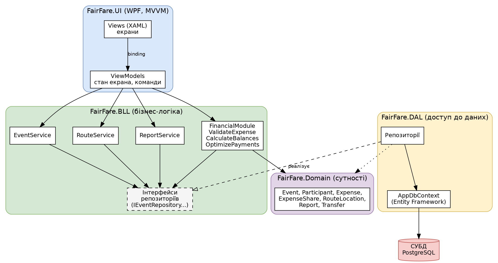
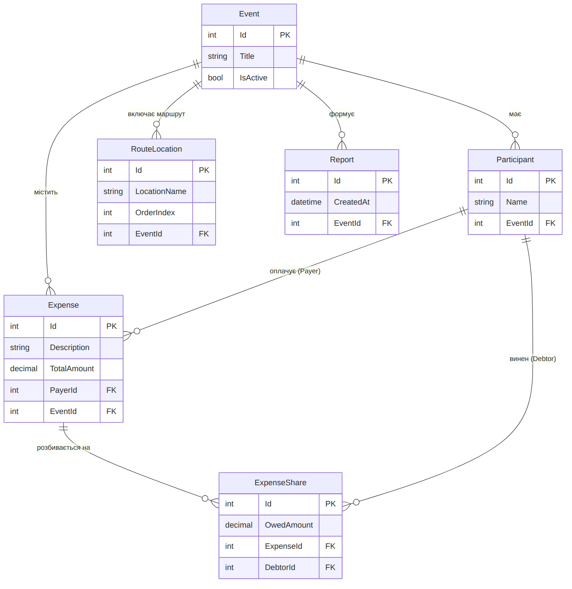

**FairFare**

Планування подорожей і справедливий розподіл спільних витрат

**Етап 4. Проєктування архітектури та даних**

# 1. Вихідні положення

Документ продовжує етап 3: усі рішення нижче спираються на побудовані
там діаграму варіантів використання, діаграму класів, діаграми
послідовності, п'ять основних сценаріїв і макети інтерфейсу. Мета етапу
– вибрати архітектурний підхід, визначити структуру рішення, розподілити
відповідальність між компонентами, спроєктувати модель даних і
обґрунтувати ключові рішення.

## 1.1. Що має забезпечити система

- Створення подорожі та керування її учасниками (сценарій 1).

- Фіксація витрат з валідацією і розподілом між боржниками (сценарій 2).

- Розрахунок балансів і формування схеми виплат зі зменшеною кількістю
  переказів (сценарій 3).

- Планування маршруту з упорядкованим списком локацій (сценарій 4).

- Формування підсумкового звіту (сценарій 5).

## 1.2. Архітектурно значущі вимоги

| **Вимога** | **Наслідок для архітектури** |
|----|----|
| Точність грошових розрахунків | Фінансова логіка винесена в окремий модуль без залежності від інтерфейсу та БД, щоб її можна було покрити модульними тестами; для сум використовується decimal (numeric у PostgreSQL) |
| Узгодженість даних при збереженні витрати | Витрата та її частки зберігаються в одній транзакції |
| Простота розгортання | Настільний застосунок, який напряму підключається до сервера PostgreSQL; окремої серверної частини з бізнес-логікою немає |
| Зміни в інтерфейсі не повинні зачіпати правила розрахунку | Шарова структура із суворим напрямком залежностей |
| Зберігання звіту локально або експорт (сценарій 5) | Факт формування звіту фіксується сутністю Report, а вміст збирається ReportService із поточних даних під час експорту |

# 2. Архітектурний підхід

Обрано шарову (багаторівневу) архітектуру із трьома рівнями:
представлення, бізнес-логіка та доступ до даних. Для інтерфейсу
застосовано шаблон MVVM, природний для WPF. Така схема відповідає
потокам, показаним на схемі взаємодії етапу 3: запит рухається вниз від
інтерфейсу до бази даних, а результат повертається вгору.

## 2.1. Принципи

- **Односпрямовані залежності.** Інтерфейс залежить від бізнес-логіки,
  бізнес-логіка від абстракцій доступу до даних. Нижні рівні нічого не
  знають про верхні.

- **Інверсія залежностей.** Бізнес-логіка оголошує інтерфейси
  репозиторіїв, а реалізує їх шар доступу до даних. Завдяки цьому логіку
  можна тестувати із замінниками замість реальної БД.

- **Єдине місце для правил.** Валідація витрат, розрахунок балансів і
  оптимізація виплат знаходяться лише в FinancialModule. Інтерфейс не
  виконує розрахунків.

- **Ін'єкція залежностей.** Сервіси та репозиторії створюються
  DI-контейнером, а не вручну у ViewModel.

# 3. Структура рішення

Рішення складається з чотирьох проєктів і, за потреби, тестового
проєкту.

| **Проєкт** | **Вміст** | **Залежить від** |
|----|----|----|
| FairFare.Domain | Сутності Event, Participant, Expense, ExpenseShare, RouteLocation, Report; клас переказу Transfer | нічого |
| FairFare.BLL | EventService, FinancialModule, RouteService, ReportService; інтерфейси репозиторіїв | Domain |
| FairFare.DAL | AppDbContext (Entity Framework), реалізації репозиторіїв, конфігурація та міграції | Domain, BLL (інтерфейси) |
| FairFare.UI | Views (XAML), ViewModels, навігація, налаштування DI | BLL, Domain |
| FairFare.Tests (опційно) | Модульні тести FinancialModule та сервісів | BLL, Domain |

*Рис. 1. Структура рішення та залежності між проєктами*

# 4. Основні компоненти та їх відповідальність

| **Компонент** | **Відповідальність** | **Пов'язані сценарії** |
|----|----|----|
| Views (XAML) | Відображення екранів, введення даних, показ повідомлень про помилки. Не містить бізнес-логіки | усі |
| ViewModels | Стан екрана, команди кнопок, виклик сервісів, перетворення результатів у вигляд для відображення | усі |
| EventService | Створення події, додавання (AddParticipant) та видалення (RemoveParticipant) учасників, зміна статусу (UpdateStatus) | 1 |
| FinancialModule | ValidateExpense (платник існує, сума більша за 0, є хоча б один боржник); CalculateBalances; OptimizePayments (формування списку Transfer) | 2, 3 |
| RouteService | Додавання локацій, зміна порядку (ChangeOrder), повернення впорядкованого маршруту | 4 |
| ReportService | Збір даних про учасників, витрати та перекази, створення запису Report, експорт підсумкового звіту (Export) | 5 |
| Репозиторії (DAL) | Читання та запис сутностей, виконання операцій у транзакції | 1–5 |
| AppDbContext | Відображення сутностей на таблиці, відстеження змін, управління транзакціями | 1–5 |
| База даних | Постійне зберігання даних подорожей | 1–5 |

Правила розподілу відповідальності:

- Інтерфейс не звертається до репозиторіїв і БД напряму.

- Сервіси не знають про WPF: вони не показують вікон і не залежать від
  типів інтерфейсу.

- Репозиторії не містять бізнес-правил, лише збереження та вибірку.

# 5. Схема взаємодії компонентів

Взаємодію між рівнями ілюструє схема потоків із етапу 3 (рис. 8
попереднього документа) і діаграми послідовності для сценаріїв 2 і 3.
Нижче наведено, як вони реалізуються компонентами.

## 5.1. Сценарій 2: додавання витрати

1.  Користувач заповнює форму; ViewModel збирає введені значення.

2.  ViewModel викликає FinancialModule.ValidateExpense. Якщо дані
    некоректні, повертається помилка і витрата не зберігається.

3.  Після успішної валідації створюється Expense та набір ExpenseShare
    для боржників.

4.  Репозиторій зберігає витрату та її частки в одній транзакції через
    AppDbContext.

5.  FinancialModule.CalculateBalances перераховує баланси, ViewModel
    оновлює екран.

## 5.2. Сценарій 3: схема виплат

1.  Екран виплат запитує у ViewModel схему для події.

2.  Репозиторії повертають витрати та їхні частки.

3.  FinancialModule розраховує баланси та викликає OptimizePayments.

4.  ViewModel отримує список Transfer або порожній список і показує
    відповідний результат.

## 5.3. Обмін даними між рівнями

| **Межа** | **Що передається** | **Формат** |
|----|----|----|
| UI → BLL | Команди та введені дані (опис витрати, сума, платник, боржники) | Виклики методів сервісів, об'єкти Domain |
| BLL → DAL | Запити на збереження і читання | Інтерфейси репозиторіїв |
| DAL → БД | SQL-запити в межах транзакції | Entity Framework |
| BLL → UI | Баланси, список Transfer, повідомлення про помилки валідації | Об'єкти Domain, результат валідації |

# 6. Модель даних

Модель даних збігається з діаграмою класів етапу 3: шість сутностей зі
зв'язками «один до багатьох». Transfer є класом моделі, але не таблицею
бази даних: перекази обчислюються з балансів за потреби.

*Рис. 2. Модель даних (ER-діаграма)*

## 6.1. Опис таблиць

| **Таблиця** | **Поля** | **Ключі** | **Призначення** |
|----|----|----|----|
| Event | Id, Title, IsActive | PK: Id | Подорож |
| Participant | Id, Name, EventId | PK: Id; FK: EventId → Event | Учасник подорожі |
| Expense | Id, Description, TotalAmount, PayerId, EventId | PK: Id; FK: PayerId → Participant, EventId → Event | Витрата та її платник |
| ExpenseShare | Id, OwedAmount, ExpenseId, DebtorId | PK: Id; FK: ExpenseId → Expense, DebtorId → Participant | Частка витрати, яку винен окремий учасник |
| RouteLocation | Id, LocationName, OrderIndex, EventId | PK: Id; FK: EventId → Event | Зупинка маршруту |
| Report | Id, CreatedAt, EventId | PK: Id; FK: EventId → Event | Підсумковий звіт події |

## 6.2. Обмеження цілісності

- TotalAmount більше 0, OwedAmount не менше 0.

- Сума OwedAmount усіх часток витрати дорівнює TotalAmount. Це правило
  перевіряє бізнес-логіка під час збереження, а не лише БД.

- Платник і боржники витрати належать до тієї ж події, що й сама
  витрата.

- Пара (EventId, OrderIndex) у RouteLocation унікальна: два місця не
  можуть мати однаковий порядок.

- Видалення події каскадно видаляє її учасників, витрати, частки,
  локації та звіти.

- Учасника, пов'язаного з витратами, видаляти не можна: це зберігає
  узгодженість балансів. Метод RemoveParticipant виконується лише для
  учасників, які ще не беруть участі у витратах.

## 6.3. Розрахункові значення

Баланс учасника не зберігається, а обчислюється: сума витрат, які він
оплатив, мінус сума його часток у чужих і власних витратах. Так дані не
можуть розійтися з витратами. Для оптимізації виплат застосовується
жадібний алгоритм із діаграми 3_4: найбільший боржник розраховується з
найбільшим кредитором, і для n учасників потрібно не більше n−1
переказів.

## 6.4. Індекси

Індекси за зовнішніми ключами EventId, PayerId, DebtorId, ExpenseId
прискорюють вибірку витрат і часток події, потрібну для розрахунку
балансів.

# 7. Обґрунтування ключових рішень

| **Рішення** | **Альтернатива** | **Обґрунтування** |
|----|----|----|
| Шарова архітектура | Клієнт-серверна з окремим API або мікросервісна | Система невелика, а окремий серверний шар із бізнес-логікою додав би складність розгортання без користі для цілей проєкту. Сервером залишається лише СУБД. Шари дають чіткий розподіл відповідальності та тестованість |
| WPF і MVVM | Логіка в code-behind | MVVM відокремлює стан екрана від розмітки, спрощує тестування і відповідає вибраній платформі WPF |
| Окремий FinancialModule | Розрахунки у ViewModel або сутностях | Розрахунки — найкритичніша частина системи; ізольований модуль легко тестується на наборах значень і не залежить від інтерфейсу |
| Entity Framework | Ручний SQL (ADO.NET) | Менше шаблонного коду, автоматичні міграції, транзакції та зв'язки між сутностями, які відповідають діаграмі класів |
| СУБД PostgreSQL | SQLite / SQL Server | Надійна безкоштовна СУБД з повноцінною підтримкою транзакцій, зовнішніх ключів і обмежень (CHECK, UNIQUE), що потрібно для узгодженості витрат і часток. Дозволяє кільком учасникам працювати з одними даними. Підключення через провайдер Npgsql для Entity Framework |
| decimal для грошей | double | Дає точні десяткові значення без накопичення похибок округлення. У PostgreSQL використовується тип numeric(18,2) |
| Баланси обчислюються, а не зберігаються | Зберігати баланс у таблиці | Виключає розбіжності між балансами та витратами; витрат на одну подію небагато, тому перерахунок швидкий |
| Transfer не зберігається (на відміну від Report) | Зберігати історію переказів | Схема виплат залежить від поточних витрат і змінюється при кожній новій витраті, тому актуальна схема завжди обчислюється наново. Звіт, навпаки, фіксує стан на певний момент, тому має власний запис |
| Транзакція при збереженні витрати | Окремі записи без транзакції | Витрата без часток або частки без витрати порушили б баланси |
| Валідація в BLL | Лише в інтерфейсі або БД | Одні й ті самі правила діють незалежно від джерела виклику, а інтерфейс лише показує результат |
